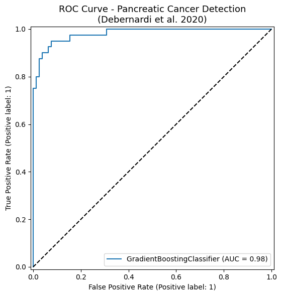
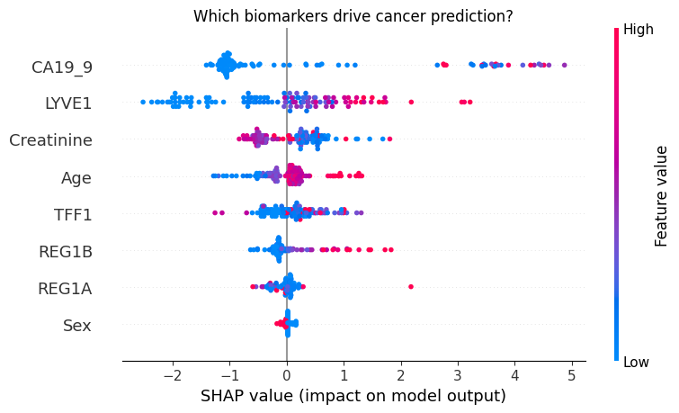

# CANary — AI-Powered Early Cancer Detection System

> Early detection saves lives. CANary uses real machine learning models trained on clinical datasets to screen for pancreatic, colon, and blood cancer risk.

**Live App:** https://canary-scan-ai.vercel.app

---

## 🧬 ML Models

| Cancer Type | Dataset | Test AUC | CV AUC (5-fold) |
|---|---|---|---|
| **Pancreatic** | Debernardi et al. 2020, PLOS Medicine | 0.9817 | 0.9467 ± 0.0142 |
| **Malignancy** | UCI Cancer Dataset (569 patients) | 0.9927 | 0.9927 ± 0.0041 |
| **Blood Severity** | CBC Health Dataset (1000 patients) | 1.0000 | 0.9998 ± 0.0002 |

**Algorithm:** Gradient Boosting with SHAP explainability
**Architecture:** 60% ML model + 40% rule engine, with automatic fallback

📓 [View full research notebook →](notebooks/canary_cancer_model.ipynb)

---

## 🔬 Key Findings

**Pancreatic Cancer:** CA19-9 is the strongest predictor, followed by LYVE1. Model catches 9 out of 10 cancer cases (recall: 0.90)

**Malignancy:** radius_mean and texture features drive classification

**Blood Severity:** Hemoglobin and WBC count are primary indicators

---

## 🖥️ How It Works

User Input → React Frontend → ML API (Render) → Gradient Boosting → Risk Score

- If ML API is available: predictions are ML-powered (AUC 0.98–1.0)
- If unavailable: falls back to rule engine automatically

---

## 🏗️ Architecture

| Layer | Technology |
|---|---|
| Frontend | React + TypeScript + Tailwind CSS |
| ML API | Python Flask + scikit-learn (Render) |
| Explainability | SHAP |
| Database | Supabase (Row-Level Security) |
| Deployment | Vercel (frontend) + Render (ML backend) |

---

## 📊 Results

### ROC Curve (Pancreatic Cancer Model)

### Feature Importance (SHAP - Pancreatic Model)

### Blood Severity Model Insights

---

## ⚠️ Disclaimer

CANary is a **screening tool only** — not a diagnostic system. All results require clinical validation by a qualified medical professional.
This system is intended for research and educational exploration and has not been clinically validated.

---

## ⚠️ Limitations

- Not clinically validated
- Dataset size is limited
- Potential bias in training data
- Not intended for medical diagnosis
  
---

## 📚 References

1. Debernardi, S. et al. (2020). A combination of urinary biomarkers improves diagnosis of pancreatic cancer. *PLOS Medicine*, 17(4).
2. Lundberg, S. & Lee, S.I. (2017). A unified approach to interpreting model predictions. *NeurIPS*.
3. Pedregosa, F. et al. (2011). Scikit-learn: Machine learning in Python. *JMLR*, 12.

---

## 👩‍💻 Author

Druhi — [canary-scan-ai.vercel.app](https://canary-scan-ai.vercel.app)
