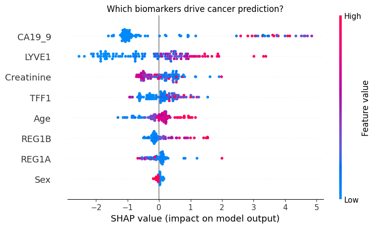
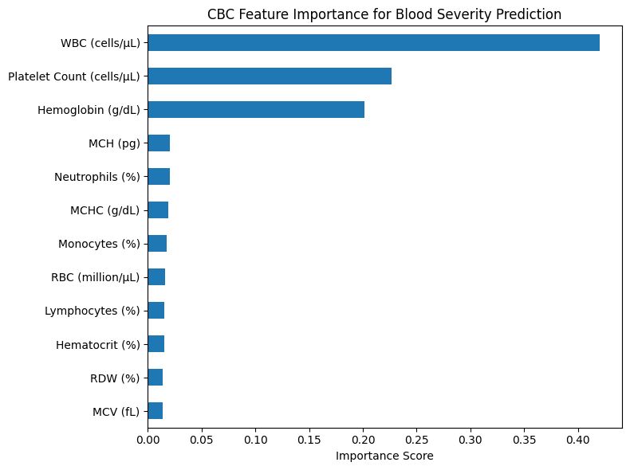

# CANary — Cancer Anticipation Network for Risk Yield

> Early detection improves clinical outcomes. CANary uses machine learning models trained on real clinical datasets to estimate cancer risk across pancreatic, malignancy, and haematological domains — with full explainability via SHAP.
>
> Developed independently by Druhi Sarupria (age 17) over approximately one year.

**Live App:** https://canary-scan-ai.vercel.app  
**Paper:** See [`notebooks/canary_cancer_model.ipynb`](notebooks/canary_cancer_model.ipynb)

[](https://canary-scan-ai.vercel.app)
[](requirements.txt)

---

## ⚠️ Disclaimer

CANary is a **research prototype and screening tool — not a diagnostic system**. All outputs require clinical validation by a qualified medical professional. This system has not undergone external clinical validation and is intended for research and educational purposes only.

---

## 🧬 ML Models

| Cancer Domain | Dataset | Test AUC | 5-Fold CV AUC | n |
|---|---|---|---|---|
| **Pancreatic (PDAC)** | Debernardi et al. 2020 | **0.9817** | 0.9467 ± 0.0142 | 590 |
| **Malignancy** | UCI Breast Cancer Wisconsin | **0.9951** | 0.9927 ± 0.0041 | 569 |
| **Blood Severity** | Synthetic CBC* | ~1.00 | 0.9998 ± 0.0002 | 1000 |

> *Near-perfect blood severity performance reflects synthetic dataset characteristics, not real-world generalisation. See Limitations.

**Algorithm:** Gradient Boosting (scikit-learn) with SHAP explainability  
**Architecture:** ML model + rule-based fallback engine with confidence scoring

📓 [View full research notebook →](notebooks/canary_cancer_model.ipynb)

---

## 📊 Model Comparison

| Model | Pancreatic AUC | Malignancy AUC | Blood Severity AUC |
|---|---|---|---|
| Logistic Regression | 0.9641 | ~0.97 | 0.8534 |
| Random Forest | 0.9761 | ~0.99 | 1.0000 |
| **Gradient Boosting (CANary)** | **0.9817** | **0.9927** | **~0.999** |

Gradient Boosting was selected as the final model due to consistently strong performance across all three datasets.

---

## 🔬 Key Findings

**Pancreatic Cancer:** CA19-9 is the strongest predictor, followed by LYVE1 — both established urinary biomarkers in clinical literature. The model achieves high recall (~0.94), successfully identifying the majority of cancer cases in the held-out test set.

**Malignancy Classification:** Radius and texture-based features from fine needle aspirate imaging are the dominant predictive indicators.

**Blood Severity:** Haemoglobin and WBC count are the most influential features, consistent with standard haematological assessment criteria.

---

## 📈 Results

### ROC Curve — Pancreatic Cancer Detection (Debernardi et al. 2020)


*GradientBoostingClassifier on urinary biomarker data. AUC = 0.98 on held-out test set.*

---

### SHAP Summary — Biomarker Attribution (Pancreatic Model)



*CA19-9 and LYVE1 dominate prediction. High feature values (red) for CA19-9 push strongly toward a positive PDAC classification, consistent with Debernardi et al. (2020).*

---

### Feature Importance — Blood Severity Model (CBC)



*WBC count, Platelet Count, and Haemoglobin are the dominant predictors.*

---

## ⚙️ Experimental Setup

- Models trained using scikit-learn GradientBoostingClassifier
- Train-test split: 80/20 stratified (random seed: 42)
- Cross-validation: 5-fold stratified CV
- Evaluation metrics: AUC-ROC, sensitivity, specificity, F1-score
- Explainability: SHAP TreeExplainer, per-prediction at inference time

---

## 🖥️ How It Works

```
User Input → React Frontend → ML Model → SHAP Explanation → Risk Score + Confidence
                                    ↓
                          Rule-Based Fallback (if biomarkers unavailable)
```

---

## 🏗️ Architecture

| Layer | Technology |
|---|---|
| Frontend | React + TypeScript + Tailwind CSS |
| ML Models | Python + scikit-learn + SHAP |
| Explainability | SHAP TreeExplainer |
| Database | Supabase (Row-Level Security) |
| Deployment | Vercel |

---

## 🔁 Reproducing the Results

```bash
pip install -r requirements.txt
cd notebooks/
jupyter notebook canary_cancer_model.ipynb
```

All preprocessing, training, cross-validation, and SHAP analysis is contained in the notebook. Runtime: ~3–5 minutes on a standard CPU.

---

## ⚠️ Limitations

- Not clinically validated — all metrics are from internal held-out splits, not external cohorts
- Limited dataset size (590 and 569 patients respectively for the two main models)
- Blood severity model trained on synthetic data; near-perfect AUC is not a clinical result
- Datasets collected primarily in European clinical settings — generalisability to South Asian and other populations is unknown
- Rule-based fallback uses published ORs/RRs which carry their own population-specificity limitations

---

## 📚 References

1. Debernardi, S. et al. (2020). A combination of urinary biomarkers improves diagnosis of pancreatic cancer. *PLOS Medicine*, 17(12), e1003489.
2. Lundberg, S. & Lee, S.I. (2017). A unified approach to interpreting model predictions. *NeurIPS*, 30.
3. Pedregosa, F. et al. (2011). Scikit-learn: Machine learning in Python. *JMLR*, 12.
4. Dua, D. & Graff, C. (2019). UCI Machine Learning Repository. University of California, Irvine.

---

## 👩‍💻 Author

**Druhi Sarupria** — Independent Researcher, Age 17  
Udaipur, Rajasthan, India  

*Developed independently without institutional affiliation or funding.*
