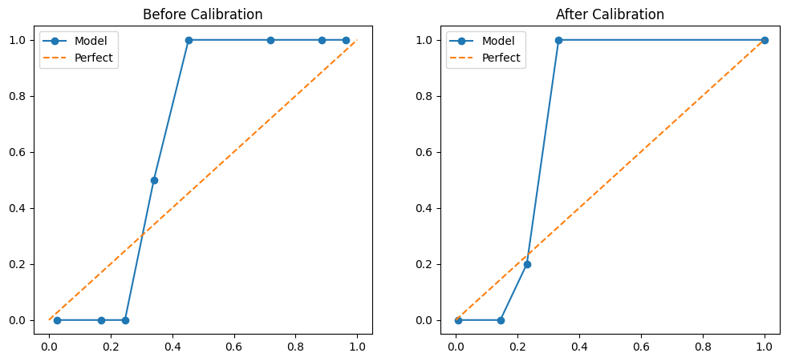
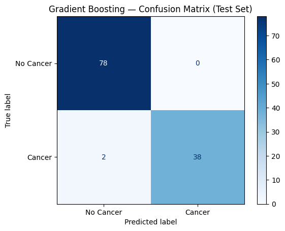

# CANary

### An Explainable Machine Learning Framework for Non-Invasive Pancreatic Cancer Risk Stratification via Urinary Biomarkers

> *"Research should not only produce accurate models—it should produce models that can be understood, reproduced, questioned, and improved."*

---

> ## Disclaimer
>
> CANary is an independent research project developed exclusively for scientific exploration and educational purposes.
>
> It is **not** a medical device, has **not** been clinically validated, and should **never** be used for diagnosis, treatment, or clinical decision-making.
>
> Every experiment contained in this repository should be interpreted solely as computational research.

---

# Why CANary Exists

Pancreatic ductal adenocarcinoma (PDAC) remains one of the most aggressive human cancers. The disease is frequently diagnosed only after it has progressed beyond stages where curative treatment is possible, contributing to one of the lowest long-term survival rates among major cancers.

Over the last decade, machine learning has become increasingly capable of identifying complex relationships within biomedical datasets. Yet many published systems remain difficult to interpret, difficult to reproduce, or optimized almost exclusively for benchmark performance.

High predictive accuracy alone is rarely sufficient for healthcare research.

Researchers, clinicians, and future developers must also understand **why** a prediction was made, **how reliable** that prediction is, and **whether the computational methodology can be independently reproduced.**

CANary was developed around that philosophy.

Rather than asking,

> *"Can another model achieve a marginally higher ROC-AUC?"*

this project asks a different question:

> **Can an explainable, transparent, and statistically validated machine learning pipeline provide meaningful insights for future pancreatic cancer research while remaining completely reproducible?**

That question defines every design decision throughout this repository.

---

# Philosophy

CANary was designed around five guiding principles.

## 1. Explainability Before Complexity

A model that cannot be understood has limited scientific value.

Every prediction produced by CANary should be accompanied by interpretable feature contributions rather than functioning as an unexplained black box.

This repository therefore integrates SHAP explainability directly into the experimental workflow.

---

## 2. Reproducibility

Scientific results should not depend on hidden notebook states or undocumented preprocessing steps.

Every reported metric in this repository is generated directly from the accompanying notebook using a reproducible computational pipeline.

---

## 3. Statistical Rigor

Model evaluation extends beyond overall accuracy.

CANary evaluates discrimination, calibration, confidence intervals, and multiple complementary performance metrics to provide a more complete understanding of model behaviour.

---

## 4. Transparency

Every computational model has limitations.

Rather than hiding them, CANary explicitly documents methodological constraints, assumptions, and future directions.

---

## 5. Accessibility

The broader motivation behind this work is to explore computational approaches that may eventually contribute to accessible, non-invasive healthcare technologies.

This repository represents one exploratory step toward that long-term vision.

---

# Project Overview

CANary is an explainable machine learning framework investigating non-invasive pancreatic cancer risk stratification using urinary biomarker data.

The project integrates traditional machine learning, explainable artificial intelligence, statistical validation, and reproducible computational workflows into a single research pipeline.

The repository includes:

- Complete Jupyter Notebook implementation
- Machine learning pipeline
- Hyperparameter optimisation
- SHAP explainability
- Statistical evaluation
- Calibration analysis
- Bootstrap confidence intervals
- Research manuscript
- Generated figures
- Exported evaluation metrics

Everything required to reproduce the reported experiments is contained within this repository.

---

# Methodology

The computational workflow follows the pipeline below.

```text
Clinical Dataset
        │
        ▼
Data Preprocessing
        │
        ▼
Feature Engineering
        │
        ▼
Train/Test Split
        │
        ▼
GridSearchCV Hyperparameter Optimisation
        │
        ▼
Gradient Boosting Classifier
        │
        ▼
Performance Evaluation
        │
        ├── ROC-AUC
        ├── Precision–Recall Analysis
        ├── Calibration Analysis
        ├── Bootstrap Confidence Intervals
        ├── Confusion Matrix
        └── SHAP Explainability
```

The primary objective is not merely to maximise predictive performance, but to produce a model whose behaviour can be inspected, interpreted, and reproduced.

---

# Model Performance

The final Gradient Boosting model demonstrated strong predictive performance on the held-out test dataset.

<p align="center">

</p>

| Metric | Performance |
|---------|------------:|
| ROC-AUC | **0.9843** |
| PR-AUC | **0.9744** |
| Sensitivity | **0.9000** |
| Specificity | **0.9487** |
| Precision | **0.9000** |
| F1 Score | **0.9000** |
| MCC | **0.8487** |
| Balanced Accuracy | **0.9244** |
| Brier Score | **0.0492** |

These metrics should be interpreted within the context of the dataset used for experimentation and should not be considered evidence of clinical effectiveness.

---

# Explainable Artificial Intelligence

Interpretability forms one of the central objectives of CANary.

Instead of treating predictions as opaque outputs, the framework applies SHAP (SHapley Additive exPlanations) to quantify the contribution of individual biomarkers and clinical variables.

<p align="center">

</p>

Understanding *why* a prediction occurs is often as important as the prediction itself, particularly within healthcare research.

---

# Calibration

Predictive confidence should reflect reality.

Calibration analysis therefore evaluates whether predicted probabilities correspond to observed outcomes rather than simply measuring discrimination.

<p align="center">

</p>

---

# Classification Performance

<p align="center">

</p>

The confusion matrix provides a direct summary of classification outcomes on the held-out test dataset.

---

# Reproducibility

Every reported experiment contained in this repository can be reproduced using the provided notebook.

The repository includes:

- Model implementation
- Hyperparameter configuration
- Exported evaluation metrics
- Saved trained model
- Research manuscript
- Generated figures

Scientific reproducibility remains one of the primary objectives of this project.

---

# Limitations

CANary represents exploratory computational research.

Current limitations include:

- Evaluation using a single publicly available dataset.
- No external multi-centre validation.
- Retrospective computational analysis.
- No prospective clinical evaluation.
- Not intended for real-world medical deployment.

These limitations should be considered when interpreting the reported results.

---

# Future Directions

Future research may include:

- External validation using independent cohorts.
- Multi-centre evaluation.
- Decision Curve Analysis.
- Additional biomarker integration.
- Federated learning.
- Deployment as an educational research platform.
- Collaboration with clinical researchers.

---

# Citation

If this repository contributes to your research, please cite:

> Druhi Sarupria.
>
> **CANary: An Explainable Machine Learning Framework for Non-Invasive Pancreatic Cancer Risk Stratification via Urinary Biomarkers.**
>
> 2026.

---

# About the Author

**Druhi Sarupria**

Student Researcher

Research interests include:

- Artificial Intelligence
- Computational Medicine
- Explainable AI
- Biomedical Machine Learning
- Healthcare Innovation

---

# Acknowledgements

This project builds upon publicly available biomedical datasets and the open-source scientific ecosystem, including Scikit-learn, SHAP, NumPy, Pandas, Matplotlib, and Jupyter.

The author gratefully acknowledges the researchers whose commitment to open scientific data made this work possible.

---

> *"Good research is not measured solely by how accurately it predicts, but by how clearly it can be understood, reproduced, and improved."*
